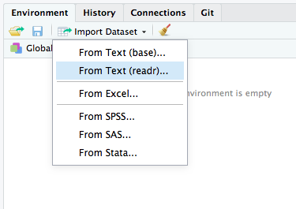

#* TODO: meter estilos css (centrar imagenes, cambiar color de fondo a los outputs, y fuente 'consolas', por ejemplo)

Vamos a realizar, uno a uno, todos los pasos descritos en el propio fichero del enunciado.

> ## 1. Descargar a local el dataset online.csv (en repositorio de GitHub ClassRoom - directorio datasets).

Para hacer uso de un dataset, hay dos opciones: 

1. importarlo mediante la interfaz gráfica de RStudio:




2. mediante la instrucción read_csv()

```{r}
library(readr)
online <- read_csv("datasets/online.csv", col_names = FALSE)
```
Nótese que hay que especificar que la primera fila no se corresponde con el nombre de las columnas, de lo contrario se perderá información de esa primera fila. Para ello, se deselecciona la opción "First row as names".

> ## 2. Analizar la estructura, tipo,… del dataset.

Para analizar la estructura de un dataset existen varias funciones, entre las cuales, las más típicas y usadas son

* class()
* mode()
* str()

El método **class()** nos devuelve una lista de las clases de las cuales hereda el objeto pasado como argumento. En este caso, como podemos comprobar, **online** hereda de las clases **tbl_df** (table dataframe), **tbl** (table) y **data.frame**(data frame)

```{r}
class(online)
```


La función **mode()**, por otro lado, nos informa del 'modo de almacenamiento' del objeto, que en este caso resulta ser de tipo **list**
```{r}
mode(online)
```


En último lugar, **str** nos muestra la **estructura** del objeto. Esta función acepta una gran variedad de argumentos, pero si la usamos pasándole únicamente el objeto cuya estructura queremos analizar, obtenemos como resultado:

* las clases de las que hereda, al igual que hace la función **class()**
* una muestra de los valores que podemos encontrar en cada uno de sus columnas, campos, o subestructuras, dependiendo del tipo de objeto con el que estemos trabajando.
* un pequeño "sumario", similar a lo que nos devuelve la función **summary()**, que veremos más adelante, pero con mucho menos detalle.

Es una función muy útil para visualizar estructuras de datos que contienen listas anidadas, aunque como gran parte de las funciones de R, puede ser usada con objetos de cualquier clase.

```{r}
str(online)
```

En est caso, observamos, como ya mencionamos antes, que **online** es un objeto que hereda de **tbl_df**,**tbl** y **data.frame**, que contiene 22343 registros de 3 variables cada uno, y que la primera columna contiene valores de tipo fecha, la segunda de tipo entero, y la tercera de tipo caracter, entre otra información.

y **las cuales son muy recomendables usar cuando empezamos a trabajar con un conjunto de datos nuevos**, ya que nos van a dar muchas pistas de qué tenemos entre manos y nos ayudará a sacar mejor provecho y de forma más rápida toda la información que contiene.

> ## 3. Analizar significado, estructura, tipo,… de cada columna.

Ya hemos comprobado previamente, gracias a la función **str**, el tipo de cada columna. De todas formas, podemos comprobarlo una a una:

```{r}
class(online$X1)
class(online$X2)
class(online$X3)
```
**class()** nos indica que la primera columna tiene fechas, la segunda valores enteros y la tercera, cadena de caracteres.
Lo mismo podemos hace con el "modo" y su estructura:

```{r}
mode(online$X1)
mode(online$X2)
mode(online$X3)
```

La función modo nos indica por su parte que la información almacenada por las tres columnas es de tipo numérico para las dos primeras, y de caracteres para la tercera, lo cual es lógico: la fecha no deja de ser una información que hace uso de las operaciones numéricas para su tratamiento, más allá de cómo se represente. Las otras dos columnas son de tipo básicos, de ahí que se almacenen directamente como números y caracteres, respectivamente.

Finalmente, con respecto a sus estructuras:

```{r}
str(online$X1)
str(online$X2)
str(online$X3)
```

podemos decir a raíz de la información obtenida que:

* las fechas se almacenan con formato **aaaa-mm-dd**
* los números de la segunda columna, se almacenan simplemente con su valor numérico correspondiente
* los valores de la tercera columna se almacenan mediante la cadena de caracteres correspondiente.  

En resumen, está claro que en el dataset con el que vamos a trabajar, la información contenida es un conjunto de 22343 registros, donde en cada uno se muestra una fecha, una cantidad, y una etiqueta correspondiente a algo que aún no sabemos lo que es, pero que se aclarará en apartados siguientes y en cualquier caso, podemos inferir, ya que vemos que son nombres de productos de supermercado. En definitiva, podemos deducir que se trata de una base de datos de productos comprados por usuarios identificados por un número, en fechas concretas.

> ## 4. Comandos para ver las primeras filas y las últimas.

Para ver las primera y últimas filas de una estructura de datos en R, es tan fácil como usar las funciones **head()** y **tail()**, que nos muestran respectivamente, las seis primeras y seis últimas filas de dicha estructura:

```{r}
head(online)
tail(online)
```


> ## 5. Cambiar los nombres de las columnas: Fecha, IDcomprador,ProductoComprado.

Como el dataset original no contiene una fila donde se indique los nombres de columnas, vamos a cambiarlos por unos nombres que sean significativos y ayuden a entender mejor a cualquier persona que los use en adelante a entender qué datos tenemos entre mano.

En primer lugar, nos cercioramos de que no tienen nombre de columnas, o simplemente, vemos qué nombres tienen actualmente, en el caso de que deseemos cambiarlos por otros más adecuados. Para ello usamos la función **colnames()**:
 
```{r}
colnames(online)
```
 
 Una forma de cambiarlos muy simple, es asignar a la propiedad **colnames** del dataset **online** los valores que deseamos de forma directa mediante la asignación tradicional en R, es decir, usando el operador **<-**. Así pues, como sabemos que el conjunto de nombres de columnas no es más que un vector de tres elementos, entonces, si ejecutamos:
 
```{r}
colnames(online) <- c("Fecha","IDcomprador","ProductoComprado")
colnames(online)
```
 Podemos ver como efectivamente, estos valores han sido modificados en la estructura.
 
 Aparte de haciendo una nueva llamada a la función colnames(), podemos cerciorarnos volviendo a ejecutar head(), ya que a parte de las 6 primeras filas, muestra el nombre de las columnas:
 
```{r}
head(online)
```
 
 
> ## 6. Hacer un resumen (summary) del dataset y analizar toda la información detalladamente que devuelve el comando.

La función ya antes mencionada **summary** nos devuelve un resumen con datos de gran utilidad a la hora de conocer cuales son las propiedades del conjunto de datos con el que vamos a trabajar. Como se ha dicho anteriormente de otras funciones, ésta puede ser usada con cualquier tipo de objeto de R, y dependiendo del caso devolverá una información u otra, pero siempre útil e interesante.

En nuestro caso, como trabajamos con un **data frame**, nos devolverá información estadística de cada una de las columnas o mejor dicho, listas, que contiene la estructura:

```{r}
summary(online)
```

En este caso, ¿qué información nos ha dado?:

* Las fechas de las compras almacenadas, están comprendidas entre el 1 de enero del año 2000 y el 26 de febrero del año 2002. Se indican también las fechas en las que se dan los cuartiles y la media, pero como suponemos que las compras se reparte de forma más o menos uniforme entre las fechas de inicio y final, esta información no es especialmente interesante (la mediana efectivamente es la fecha intermedia entre las de inicio y final, por ejemplo).
* Hay un total de 1139 identificadores de comprador distintos, esto es, durante esos dos años y dos meses, el negocio vendió productos a 1139 personas distintas, las cuales pudieron, como es lógico hacer más de una compra en ese periodo. De nuevo, los datos de cuartiles no parecen especialmente relevantes, aunque igualmente son indicados por **summary**
* En cuanto a los productos, hay un total de 22343 productos comprados en el periodo que comprende el conjunto de datos, y como es de esperar, todos ellos son representados por cadenas de caracteres.


> ## 7. Implementar una función que usando funciones vectoriales de R (apply, tapply, sapply,…) te devuelva un primer valor booleano para saber si hay valores NA en alguna columna del dataset. Si así lo fuera devolver sus índices y además sustituirlos por el valor 0.

En primer lugar, y para saber si la función que hagamos en este paso realmente funciona, vamos a ver si existen valores **NA** e nuestro conjunto de datos **online**

```{r}
length(which(is.na(online$Fecha)))
length(which(is.na(online$IDcomprador)))
length(which(is.na(online$ProductoComprado)))
```

Es decir, sabemos desde este momento que no hay ningún valor **NA** en el *dataset*. Otra forma de comprobarlo

```{r}
which(is.na.data.frame(EuStockMarkets))
```

Y una tercera forma:

```{r}
anyNA(online)
```

Es decir, sabemos de antemano que la función que vamos a generar va a devolver una lista con el valor **FALSE**, indicando que no hay valores **NA**, el *dataframe* **online** tal cual, ya que no contiene valores **NA**, y por último, un vector vacío, ya que no hay posiciones donde encontrar ningún valor **NA**.

En cualquier vamos a crear la función solicitada y probarla con algún dataset que sepamos que tiene valores NA, para demostrar que efectivamente funciona. El código de nuestra función es:

```{r}
na.in.dataframe <-function(dataframe){

  anyNaValues <- anyNA(dataframe)
  
  if(!anyNaValues){
    dataframeWithoutNas <- dataframe
    nasPositions <- vector()
  }else{
    m <- as.matrix(dataframe)
    nasPositions <- which(is.na(m))
    m[is.na(m)] <- 0
    dataframeWithoutNas <- as.data.frame(m)
  }
  
  return(list(any.nas = anyNaValues, 
              dataframe.without.nas = dataframeWithoutNas, 
              nas.positions = nasPositions))  
}
```

Para comprobar su correcto funcionamiento, vamos a insertar valores NA en la colección:

```{r}
online$Fecha[50] <- NA
online$IDcomprador[60] <- NA
online$ProductoComprado[70] <- NA
df <- na.in.dataframe(online)
df$any.nas
df$nas.positions
df$dataframe.without.nas[1:70,]
```

Para los índices, se da una lista de ellos dando por hecho que se usa una estructura de tipo vector, es decir, para cada valor **NA** encontrado, se da su índice considerando que todos los datos de todas las columnas se concatenan. ASí pues, si tenemos un *dataframe* formado por 3 columnas de 1000 valores cada una, y la función nos indica que hay un valor **NA** en la posición 1500, esto significa que el valor 500 de la segunda fila es **NA**. Se podría haber devuelto una lista para cada columna, pero como el enunciado no especifica, se ha resuelto de esta forma.

Antes de continuar, recargamos los datos para desaparezcan los valores **NA** introducidos antes:

```{r}
library(readr)
online <- read_csv("datasets/online.csv", col_names = FALSE)
colnames(online) <- c("Fecha","IDcomprador","ProductoComprado")
```


> ## 8. Calcular el número de filas del *dataset*

El número de filas del *dataset* ya lo conocemos gracias a las funciones que hemos ejecutado anteriormente (**str**, **summary**), pero por supuesto existen otras formas de descubrirlo como por ejemplo el método **dim**, que aunque no nos sirve para saber directamente el número de filas, si nos puedo ayudar gracias a lo que ya conocemos de la estrucutra de datos **online**: como es una estructura de tipo tabla, entonces sabemos que está formada por un número de filas y otro de columnas. Si usamos esta función, el resultado es:

```{r}
dim(online)
```

Es decir, nos dice de una forma implícita que está formada por 22343 filas y 3 columnas. Si queremos trabajar con el número de filas, y almacenar ese dato en una variable llamada por ejemplo **numero.filas**, tan solo tendríamos que tomar el primer elemento del vector que devuelve **dim**, de este modo:

```{r}
numero.filas <- dim(online)[1]
numero.filas
```

Hay que tener cuidado, ya que podemos pensar que la función **length** podría servirnos para obtener el número de filas, pero esto no es así: como **online** es un conjunto de datos estructurado en listas, al ejecutarlo nos devolverá el número de listas que lo forma, que nosotros hemos interpretado previamente como columnas, esto es, nos devolverá que la longitud del conjunto de datos es 3:

```{r}
length(online)
```

De todas formas, si queremos usar **length** para saber el número de filas, no hay problemas: usemoslo para ver cuantos elementos contiene cualquiera de las tres listas que forman la estructura de datos:

```{r}
length(online$Fecha)
length(online$IDcomprador)
length(online$ProductoComprado)
```
Es decir, de esta manera está más que confirmado que el *dataset* está formado por 22343 filas.

> ## 9. Calcula en cuántas fechas distintas se han realizado ventas.

Para el ejercicio 9, 10 y 11, vamos a proceder de la misma manera. La función que nos va a permitir ver cuántos elementos distintos hay dentro de una colección de datos, (en este caso, en una columna dada) es **factor**. Si ejecutamos (uso **head** para que no se muestren todos los elementos, los cuales ocuparían mucho espacio en el documento y se hace molesto de visualizar): 

```{r}
head(factor(online$Fecha))
```
 obtenemos una lista de todas las fechas existentes en esa columna del *dataset*, pero ya no son tratadas como fechas, sino como **factores**. En la línea final podemos ver que hay 603 niveles, es decir, 603 elementos distintos entre si, o lo que es lo mismo, 603 fechas distintas. Si queremos ver cuáles son esas fechas distintas, tenemos varias formas (uso **head** de nuevo por el mismo motivo):
 
```{r}
head(levels(factor(online$Fecha)))
```
 
que como podemos ver, contiene un total de 603 elementos. Si queremos obtener es número, no tenemos que "contarlos", es tan fácil como usar la función **length**

```{r}
numero.de.fechas.distintas <- length(levels(factor(online$Fecha)))
numero.de.fechas.distintas
```

De cualquier de estas formas, hemos comprobado que hay 603 fechas distintas. Quizás, cuando programemos, la más interesante es la última, ya qu es la que nos permite almacenar en una variable el número buscado, y usarlo para siguientes operaciones.

En los siguientes dos ejercicios, conocidas yas las formas de obtener el número distinto de elementos para cada columna, simplemente ejecutaremos código e indicaremos el número deseado.


> ## 10. Calcula cuántos compradores distintos hay en el dataset.

Repetimos las instrucciones antes explicadas:

```{r}
numero.de.compradores.distintos <- length(levels(factor(online$IDcomprador)))
numero.de.compradores.distintos
```

El número de compradores distintos es 1139, aunque gracias a la función **summary** este dato ya lo conocíamos.


> ## 11. Calcula cuántos productos distintos se han vendido.

Repetimos las instrucciones antes explicadas:

```{r}
numero.de.productos.distintos <- length(levels(factor(online$ProductoComprado)))
numero.de.productos.distintos
```

El número de productos distintos es 38.


> ## 12. Visualiza con distintos gráficos el dataset.

* Los valores distintos de cada columna con varios tipos de gráficos.
* Enfrenta unas variables contra otras para buscar patrones y comenta los patrones que puedas detectar.

> ## 13. Usa split para construir a partir del dataset una lista con nombre lista.compra.usuarios en la que cada elemento de la lista es cada comprador junto con todos los productos que ha comprado (de forma similar a lo visto en clase en el recomendador).

Para obtener la lista pedida, tan solo hay que usar el método split con los parámetros deseados, esto es, le indicámos qué datos queremos listar y en base a qué otro parámetro, en este caso queremos listar los productos según el cliente, que a su vez está identificado por el identificador **IDcomprador**:

```{r}
lista.compra.usuarios <- split(x=online$ProductoComprado,f=online$IDcomprador)
head(lista.compra.usuarios)
```


> ## 14. Hacer summary de lista.compra.usuarios.

Si usamos la función **summary** con la estructura obtenida en el paso anterior, obtendríamos un pequeño "informe" por cada uno de los elementos de esa lista. Por ello, vamos a aplicarlo solo a los primeros seis elementos:

```{r}
summary(head(lista.compra.usuarios))
```

Como podemos comprobar, por cada uno de los elementos de la lista obtenida, o dicho de otra forma, por cada uno de los usuarios que han sido registrados en el *dataset* original, se muestra en número de productos que ha comprado (no necesariamente el número de productos distintos), así como la clase (class) y modo (mode) de almacenamiento. En este caso, como los productos se almacenan con su nombre, tenemos que los elementos dentro de cada lista no tienen clase y son almacenados en modo *character*.

> ## 15. Contar cuántos usuarios hay en la lista lista.compra.usuarios.

> ## 16. Detectar y eliminar duplicados en la lista.compra.usuarios (AYUDA: Usar lapply llamando a función unique).

> ## 17. Contar cuántos usuarios hay en la lista después de eliminar duplicados.

> ## 18. Convertir a tipo de datos transacciones. Guardar en Tlista.compra.usuarios.

> ## 19. Hacer inspect de los dos primeros valores de Tlista.compra.usuarios.

> ## 20. Buscar ayuda de itemFrequencyPlot para visualizar las 20 transacciones más frecuentes.

> ## 21. Generar las reglas de asociación con 80% de confianza y 15% de soporte.

> ## 22. Ver las reglas generadas y ordenalas por lift. Guarda el resultado en una variable nueva.

> ## 23. Elimina todas las reglas redundantes de las dos formas vistas en clase. Calcula el % de reglas redundantes que había usando cada uno de los dos métodos.

> ## 24. Dibuja las reglas ordenadas y no redundantes usando paquete arulesViz. Si son muchas visualiza las 20 primeras.

> ## 25. MUY IMPORTANTE: Investigar algún otro paquete R relacionado con reglas de asociación (no visto en clase). Explicar su uso con un dataset y con ejemplos.

> # Conclusiones